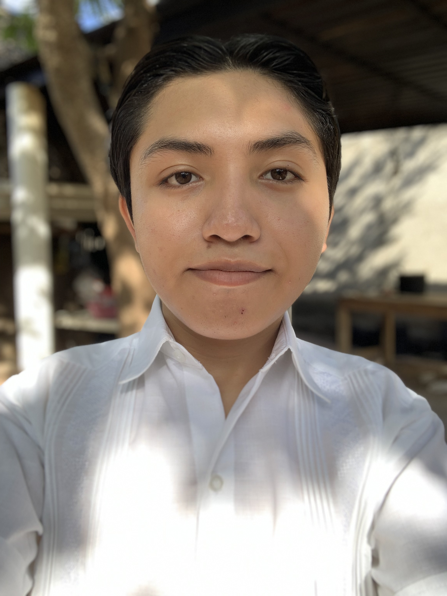
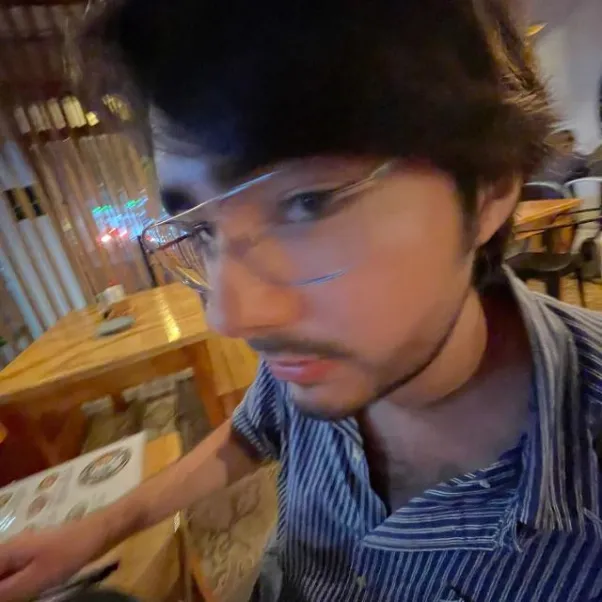
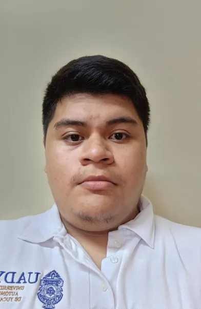

# HCI

Proyecto de la asignatura Interacción Humano Computadora (2024).

### Integrantes del equipo

| Nombre                         | Foto                                                 |
|--------------------------------|------------------------------------------------------|
| Reynaldo Alexander Couoh Martin|          |
| Daniel Méndez Sierra          |            |
| Víctor Flores Juárez          |            |
| Marco Elias Aragón Serrano    |             |
| Ángel Alberto González Lugo   |             |
